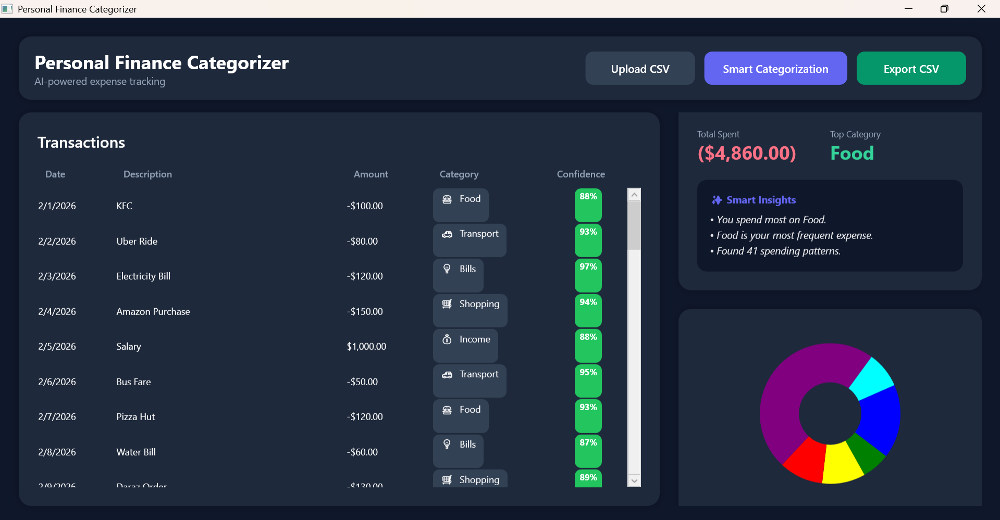
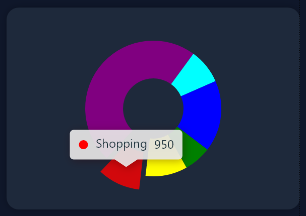
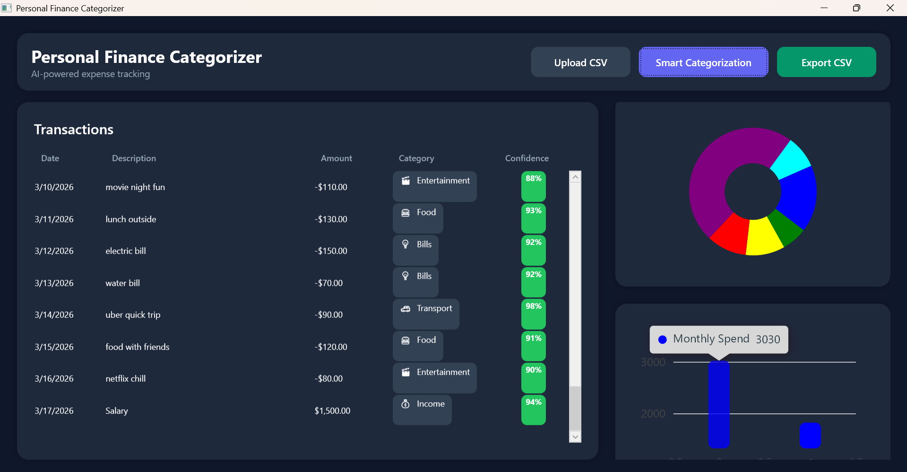

# 💸 Personal Finance Categorizer  
### 🧠 AI-Powered Expense Intelligence Desktop App

A modern desktop application that transforms raw transaction data into clear, actionable financial insights using AI and smart categorization.

---

## 🚀 Overview

**Personal Finance Categorizer** is a WPF desktop application built with **.NET 8** that helps users:

- 📂 Upload transaction data (CSV)
- 🤖 Automatically categorize expenses using AI
- 📊 Analyze spending behavior
- 📈 Visualize financial patterns

It combines **AI + rule-based logic** to deliver results that are both **accurate and explainable**.

---

## ✨ Key Features

### 🤖 AI-Powered Expense Tracking
- Understands real-world, messy transaction descriptions
- Uses AI (OpenAI API) for intelligent classification
- Generates clear, human-readable insights

### 🧠 Smart Categorization System
- AI-based classification for high accuracy
- Rule-based fallback for offline reliability
- Confidence scoring for each prediction

---

## 📊 Supported Categories

- 🍔 **Food**
- 🚗 **Transport**
- 💡 **Bills**
- 🛒 **Shopping**
- 🏥 **Health**
- 🎬 **Entertainment**
- 💰 **Income**
- 📦 **Other**

---
## 📂 Flexible CSV Processing

- 📥 Upload custom transaction files  
- 🔄 Handles varied column names automatically  
- 🛡️ Robust parsing with strong error handling  
- 📤 Export categorized results for further use  

---

## 📊 Insight Dashboard

- 💰 Total spending overview  
- 🏆 Top spending category  
- 🔁 Most frequent category  
- ⚖️ Net balance calculation  
- 🤖 AI-generated financial insights  

---

## 📈 Data Visualization

- 🥧 Pie chart for category distribution  
- 📊 Bar chart for monthly spending trends  
- ✨ Smooth animations with a modern UI experience  

---

## 🖥️ Tech Stack

| Layer           | Technology              |
|----------------|------------------------|
| 🎨 UI           | WPF (XAML)             |
| ⚙️ Framework    | .NET 8                 |
| 🏗️ Architecture | MVVM                   |
| 📊 Charts       | LiveCharts2            |
| 📄 CSV Parsing  | CsvHelper              |
| 🤖 AI           | OpenAI API             |
| 🎨 UI Design    | MaterialDesignInXAML   |

# 🧱 Architecture

The project follows a clean **MVVM (Model-View-ViewModel)** structure:

- **Models/** → Data structures (e.g., `Transaction`, `Category`)
- **ViewModels/** → Application logic (MVVM pattern)
- **Views/** → UI components (XAML)
- **Services/** → AI integration and CSV processing
- **Helpers/** → Utility functions (converters, fallback rules)

---

# 🔐 Security & Configuration

This project follows secure API practices:

- ❌ No API keys stored in source code  
- ✅ Uses environment variables for sensitive data  

## 🔑 Setup API Key

### PowerShell

```powershell
$env:OPENAI_API_KEY="your_api_key_here"
```

## 🪟 Windows Setup (Recommended)

### 1. Open Environment Variables

Add a new environment variable:

- **Name:** `OPENAI_API_KEY`
- **Value:** `your_api_key_here`

---

## ▶️ Getting Started

### 1. Clone Repository

```bash
git clone https://github.com/your-username/personal-finance-categorizer.git
cd personal-finance-categorizer
```

### 2. Run Application

```bash
dotnet run
```

### 3. Use the App

- Upload a CSV file
- Click **Smart Categorization**
- View insights and charts

# 📁 Example CSV Format

```csv
Date,Description,Amount
2026-02-01,KFC,-100
2026-02-02,Uber Ride,-80
2026-02-03,Electricity Bill,-120
2026-02-04,Amazon Purchase,-150
2026-02-05,Salary,1000
```

## 🧪 Real-World Data Handling

The system is designed to handle different types of input quality:

- **Clean inputs** → High accuracy  
- **Semi-random inputs** → AI-based inference  
- **Noisy data** → Fallback categorization  

### Example

| Input          | Output          |
|----------------|-----------------|
| "KFC"          | Food            |
| "Movie Night"  | Entertainment   |
| "paid stuff"   | Other           |

---

## 🎯 Why This Project Matters

This project demonstrates:

- Real-world AI integration  
- Clean MVVM architecture  
- Data processing pipelines  
- UI/UX design principles  
- Secure API handling  

## 📸 Preview




---

## 🤝 Contribution

Contributions are welcome!  
Feel free to fork this repository and improve it.

---

## ⭐ Support

If you found this project useful:

- ⭐ Star the repository  
- 📢 Share it with others  
- 🚀 Build on top of it  

---

## 👨‍💻 Author

**Nahian Bin Rahman**  
AI Engineer 

---

## 💡 Final Impression

This project is not just a tool — it’s a **mini AI product** that showcases:

- 🧠 Intelligence  
- 🎯 Usability  
- 🌍 Real-world application  